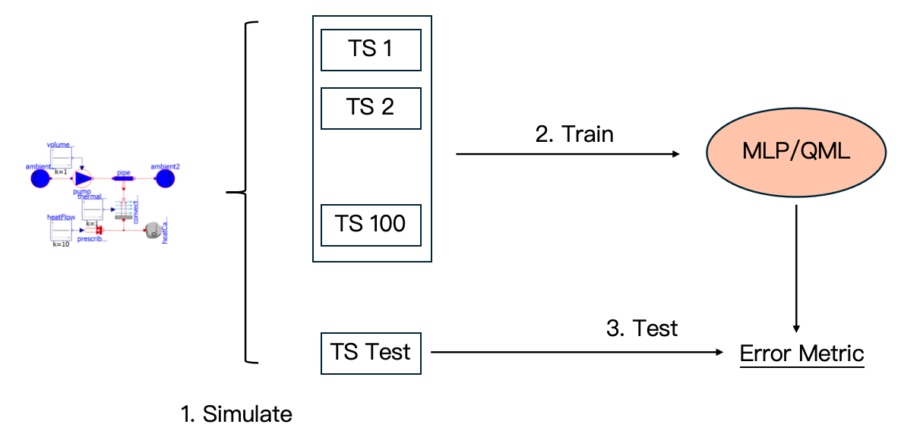
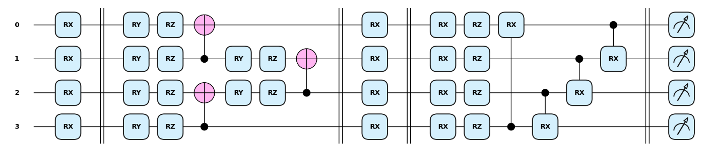

# Surrogate Models for System Optimization

This repository contains the research and implementation of surrogate models for complex physical systems, developed for the **QC Optimization Challenge** at the Lehrstuhl für Mobile und Verteilte Systeme, LMU Munich (WS24/25).

## Introduction
Physical simulations in engineering are often computationally expensive. **Surrogate modeling** addresses this by training lightweight **approximations of these simulations**. This project generates data from six OpenModelica physical simulations and trains both **classical MLPs (ANNs)** and **Quantum Neural Networks (QNNs)** as surrogate models, comparing their performance.

**Tech Stack:** TensorFlow, KerasTuner, OpenModelica, Scikit-learn, Pandas, NumPy, Cirq, TensorFlow Quantum, Qiskit.

## Approach
The image below summarizes our approach: First, we generated data from 6 different [OpenModelica](https://openmodelica.org/) simulations, described in detail [here](docs/physical_systems.md). For each system, we split the data into training, validation, and test sets, and trained both a classical MLP and a QNN as the surrogate model. Model checkpoints with the lowest MSE score on the validation set are saved for prediction on the test set. The prediction is evaluated using the MASE metric.




## Project Structure

```bash
├── data/                    # All datasets and simulation outputs
├── models/                  # Model checkpoints and KerasTuner architecture configs
├── notebooks/               # Jupyter notebooks for exploration and hardware runs
├── scripts/                 # Execution scripts for training and testing
├── src/
│   ├── models/              # Model implementations (ANN, QNN, Abstract class)
│   ├── tuning/              # Hyperband optimization implementation
│   └── utils/               # Preprocessing and experiment pipeline utilities
└── requirements.txt         # Project dependencies
```

## Installation (to reproduce)
To set up the environment using Docker, follow these steps:

1. Build the Docker container:
``` bash
docker build -t "desired_container_tag" .
```

2. Run the container:
```bash
docker run -it -v "path/to/repository":/app -w /app "desired_container_tag"
```


## Data
- **Data Generation:** 
    - Our data was generated using [OpenModelica](https://openmodelica.org/), an open-source Modelica-based simulation environment. 
    - We ran simulations for 6 different physical systems and exported the time-series data as `.csv` files into `data/paper_data/`, where each row represents the state of the system at a specific time step.
- **Data Preprocessing:** 
    - The rows of each OpenModelica simulation are formatted as transition pairs. 
    - The resulting set of pairs is split into training and validation sets (70/30 ratio). A separate test set is constructed under `data/paper_data/physical_system/test_data`.
    - Before training, inputs are scaled using `StandardScaler` from the `sklearn.preprocessing` package.
    - Preprocessing logic can be found in `src/utils/preprocessing.py`.


### ANN (Classical MLPs)
- **Model Architecture:**
    - Our ANN model is implemented as a **Keras** model in `src/models/ANN.py`.
    - The number of input and output nodes corresponds to the state variables in each simulation. Hyperparameters (hidden layers, neurons, activation functions) were optimized using **KerasTuner** and saved as JSON configurations in `models/ann_configs/`.
- **Experiment:**
    - **Training:** Each ANN is trained for 500 epochs.
    - **Validation:** Model checkpoints are saved based on the lowest MSE score on the validation set at `models/final_ann_models/`.
    - **Testing:** The best-performing models are evaluated on the test set using the **MASE** metric.

### QNN
- **Model Architecture:**
Our QNN model is implemented as a **Keras** model using **TensorFlow Quantum** in `src/models/QNN.py`. It consists of a single **PQC** (Parametrized Quantum Circuit) layer with the following structure:
  - **Data Encoding**: Input features are encoded using `RX` gates (data re-uploading strategy).
  - **Entangling Layers**: A concatenation of **Circuit 19** (strongly entangling) and **Circuit 11** (hardware-efficient), as described in [Sim et al. (2019)](https://arxiv.org/abs/1905.10876).
  - **Measurement**: Z-basis expectation values on all qubits form the classical output.


- **Simulation:**
Each QNN is trained for 50 epochs on the preprocessed simulation data. The model checkpoint with the lowest validation MSE is saved in `models/final_qnn_models/` for testing.

- **Hardware Runs:**
We utilize `scripts/QC_hardware.py` to execute predictions on **IBM Quantum hardware** (e.g., `ibm_kyiv`). Due to time constraints (10 minutes free usage per month), we load the model weights pre-trained in simulation and perform **inference only** to evaluate the system trajectory on a real quantum processor.


